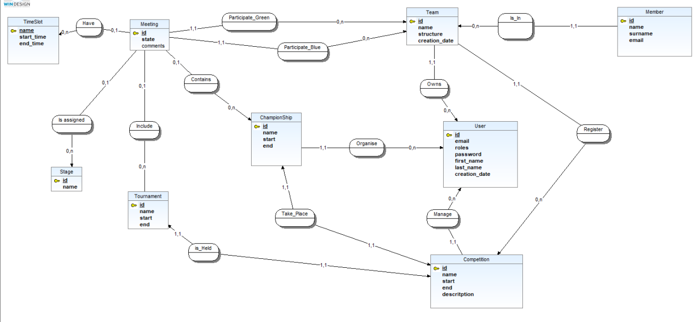

# Symfony Project - RobotCup

## Prerequisites

1. **Install PHP**  
   Download and install PHP from [php.net](https://www.php.net/).  
   website is made with 8.3.6 version


2. **Install Symfony**  
   Download and install Symfony via [symfony.com/download](https://symfony.com/download).  
   website is made with 5.10.4 version

---

## Project Installation

1. **Clone the Git Repository**  
   Run the following command to clone the project:  
   ```bash
   git clone git@gitlab-ce.iut.u-bordeaux.fr:tdanguydesde/sae_s3.01.git
   ```

2. **Launch the Project**  
   Navigate to the project directory:  
   ```bash
   cd RoboCup/sae_s3.01-main/RobotCup
   ```  
   Install Symfony dependencies by running:  
   ```bash
   composer install
   ```
   creat a new file named `.env.local` and put this code line completed with you access to the data base : 
   ```
   DATABASE_URL={YourDataBaseLink}
   ```
   Install React dependencies by running:  
   ```bash
   npm install react react-dom
   ```  
   Install Babel React preset:  
   ```bash
   npm install @babel/preset-react --save-dev
   ```  
   Start the local web server with the following command:  
   ```bash
   symfony serve
   ```  
   Finally, open this link to access the homepage: [http://127.0.0.1:8000](http://127.0.0.1:8000).

3. **Check Coding Standards**  
   Run the following command to install the coding standards checker:  
   ```bash
   composer require --dev squizlabs/php_codesniffer
   ```  
   You might see the following message:  
   ```bash
   Pick one of these or leave empty to abort:
   [0] squizlabs/php_codesniffer
   [1] squizlabs/php_codesniffer_tests
   [2] memaw/phpcs
   [3] silverstripe/markdown-php-codesniffer
   ```  
   Enter `0` and confirm your choice.

   Then, run this command to check if the coding standards are respected:  
   ```bash
   ./vendor/bin/phpcbf --standard=PSR12 src/
   ```

4. **Test Accounts**  
   Test accounts were created for each role:  
   
   **Admin:**  
   * Email: admin@admin.com  
   * Password: 123456

   **Organizer:**  
   * Email: 
   * Password: 

   **User:**  
   * Email: 
   * Password: 

5.**Create a Organiser account with admin**  
   * go to this path : http://127.0.0.1:8000/fr/user/new and creat a new user by entering his data and select the organiser role.
   * if you wanna do the whole path by hand from the front-page :
      * you can click on the `User` button on the navigation bare on top of the website.
      * then you clcik on the `creat new User` button.

---

## Database
1. **MCD Image**  


2. **Integrity Constraints** 

The constraints are made with doctrine orm in the most case but for other we use #[Assert\] and functions in entity files for the application and in the file `migrations/Version20250110105355. php` for the database part in sql with the addSql() function.

We name the constraints when we can so here you can see a little description of each constraint and the name if we named it.
   * **Unique constraints** 
      * Unique user email 
      * Unique team name by competition : UNIQ_TEAMCOMPETITION
      * Unique competition name 
   * **Selection** 
      * User roles in ROLE_ADMIN, ROLE_ORGA, ROLE_USER : CHK_ROLES
      * Meeting state in TO_PLAY, PLAYED, GAVE_UP, CANCELLED : CHK_MEETING_STATE
      * Team state in WAITING, ACCEPTED, REFUSED : 
   * **Time logic**
      * Competition start is before competition end : CHK_COMPETITION_START_BEFORE_END
      * championship start is before championship end
      * Tournament start is before tournament end : CHK_TOURNAMENT_START_BEFORE_END
      * Tournament start correspond to the championship end : CHK_CHAMPIONSHIP_START_BEFORE_END
      * Time Slot start is before timeSlot end : CHK_TIMESLOT_ORDER
      * Time Slot start and end are between 0 and 23 : CHK_TIMESLOT_RANGE
      * One meeting per stage and per timeSlot, can't overlap : TRG_OVERLAP_MEETING
      * Only one competition at a time : TRG_COMPETITION_DATES
   * **Application logic**
      * Positive scores 
      * Different teams in a match : CHK_TEAMS_DIFFERENT
      * Only one match per championship or tournament with the same two teams : UNIQ_MEETING
      * A team owner must have the ROLE_USER role : TRG_CHCK_OWNER_ROLE
      * An organizer must have the ROLE_ORGA role : TRG_CHECK_ORGANIZER_ROLE
      * A match must belong to either a championship or a tournament (not neither and not both) : CHK_ONE_CHAMPIONSHIP_OR_TOURNAMENT